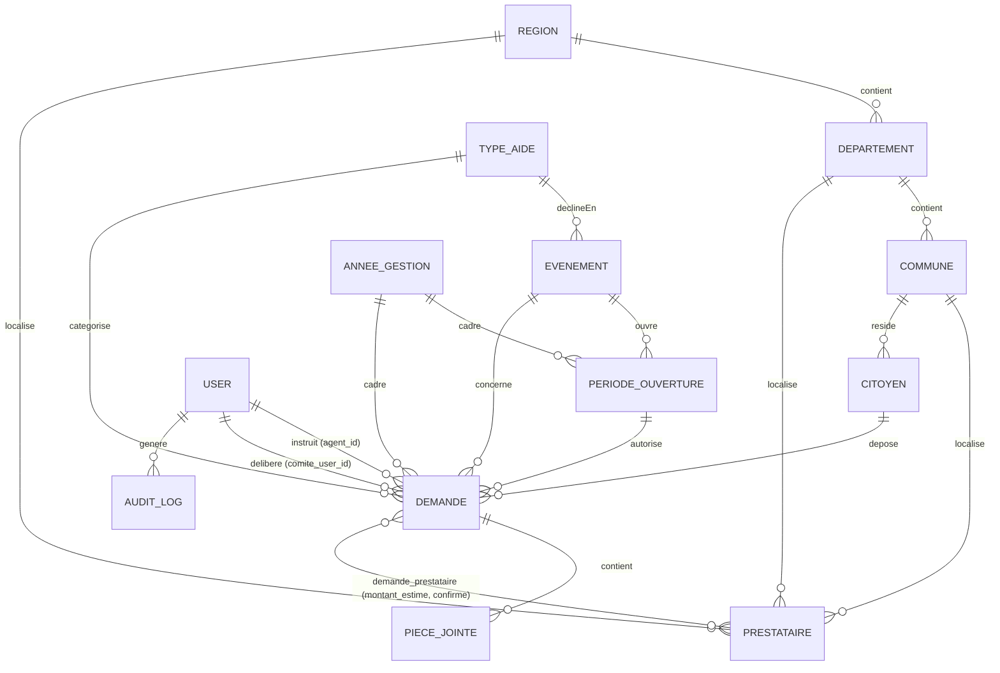

# Modèle de données

## Schéma relationnel

## Tables et modèles

### Référentiels géographiques

| Table | Modèle | Colonnes clés | Relations |
|---|---|---|---|
| `regions` | `Region` | `nom`, `code` (unique, 10) | `hasMany` `departements`, `hasMany` `prestataires` |
| `departements` | `Departement` | `region_id` (FK cascade), `nom`, `code` (unique) | `belongsTo` `region`, `hasMany` `communes`, `hasMany` `prestataires` |
| `communes` | `Commune` | `departement_id` (FK cascade), `nom`, `code` (unique, 20) | `belongsTo` `departement`, `hasMany` `citoyens`, `hasMany` `prestataires` |

Seedées par `ReferentielSeeder` : 14 régions, 45 départements, 336 communes du Sénégal.

### Référentiels métier

| Table | Modèle | Colonnes clés | Relations |
|---|---|---|---|
| `types_aide` | `TypeAide` | `nom`, `code` (unique, 30), `description`, `actif`, `requiert_periode` (bool) | `hasMany` `evenements`, `hasMany` `demandes` |
| `evenements` | `Evenement` | `type_aide_id` (FK cascade), `nom`, `code` (unique, 30), `description`, `actif` | `belongsTo` `typeAide`, `hasMany` `periodesOuverture`, `hasMany` `demandes` |
| `periodes_ouverture` | `PeriodeOuverture` | `evenement_id`, `annee_gestion_id` (FK cascade, unique ensemble), `date_debut`, `date_fin`, `actif` | `belongsTo` `evenement`, `belongsTo` `anneeGestion` |
| `annees_gestion` | `AnneeGestion` | `annee` (unique), `statut` (enum DB `ouvert`/`cloture`/`archive`), `date_ouverture`, `date_cloture` | `hasMany` `periodesOuverture`, `hasMany` `demandes` |
| `prestataires` | `Prestataire` | `nom`, `type` (enum DB `hopital`/`pharmacie`/`clinique`/`autre`), `adresse`, `telephone`, `email`, `region_id`/`departement_id`/`commune_id` (FK nullable, `nullOnDelete`), `actif` | `belongsTo` region/departement/commune, `belongsToMany` `demandes` (pivot) |

`requiert_periode` détermine si un événement de ce type d'aide doit obligatoirement avoir une période d'ouverture active pour accepter des demandes (seul le type « Événements religieux » l'exige actuellement).

### Citoyens

**Table `citoyens` / Modèle `Citoyen`**
- Colonnes : `cin` (unique, 20), `nom`, `prenom`, `telephone`, `adresse`, `commune_id` (FK nullable).
- Relations : `belongsTo` `commune`, `hasMany` `demandes`.
- Méthodes métier :
  - `nomComplet()` — concatène prénom + nom.
  - `estRecurrent()` — `true` si le citoyen a déjà une demande **APPROUVÉE** sur une année antérieure (affiché comme signal d'alerte au comité, voir [workflow-demandes.md](workflow-demandes.md)).
  - `demandesParTypeEtAnnee($typeAideId, $anneeGestionId)` — compte les demandes non rejetées du citoyen pour un couple type/année (base de la règle de quota).

### Demande — entité centrale

**Table `demandes` / Modèle `Demande`** (`#[ObservedBy(DemandeObserver::class)]`)

| Colonne | Type | Contrainte |
|---|---|---|
| `reference` | string(20), nullable, unique | générée automatiquement à la création, format `DPS-{ANNEE}-{SEQUENCE}` |
| `citoyen_id` | FK → `citoyens` | `cascadeOnDelete` |
| `type_aide_id` | FK → `types_aide` | `restrictOnDelete` |
| `evenement_id` | FK → `evenements`, nullable | `nullOnDelete` |
| `annee_gestion_id` | FK → `annees_gestion` | `restrictOnDelete` |
| `periode_ouverture_id` | FK → `periodes_ouverture`, nullable | `nullOnDelete` |
| `agent_id` | FK → `users` | `restrictOnDelete` — agent instructeur |
| `comite_user_id` | FK → `users`, nullable | `nullOnDelete` — membre du comité ayant délibéré |
| `statut` | enum DB | `brouillon` (défaut) / `soumis` / `en_examen` / `approuve` / `rejete` / `cloture` |
| `montant_total` | decimal(12,2), nullable | somme des `montant_estime` des prestataires liés |
| `commentaire` | text, nullable | motif de rejet ou commentaire d'approbation |
| `date_soumission`, `date_deliberation`, `date_cloture` | datetime, nullable | horodatage des transitions |

Relations : `belongsTo` `citoyen`/`typeAide`/`evenement`/`anneeGestion`/`periodeOuverture`, `belongsTo` `agent` (User), `belongsTo` `comiteUser` (User), `belongsToMany` `prestataires` (pivot `demande_prestataire`), `hasMany` `piecesJointes`.

Scopes : `scopeEnAttente` (statut `soumis` ou `en_examen`), `scopeParStatut($statut)`.

Règle métier statique : `Demande::quotaAtteint($citoyenId, $typeAideId, $anneeGestionId)` → `true` dès que ≥ 2 demandes non rejetées existent pour ce triplet (voir [workflow-demandes.md](workflow-demandes.md)).

Méthodes de transition d'état (machine à états, voir diagramme dans [workflow-demandes.md](workflow-demandes.md)) : `soumettre()`, `prendreEnExamen(User $membreComite)`, `approuver(User $membreComite, ?string $commentaire)`, `rejeter(User $membreComite, string $commentaire)`, `cloturer()`.

**Table pivot `demande_prestataire`** : `demande_id`, `prestataire_id` (FK cascade, unique ensemble), `montant_estime` (decimal 12,2, défaut 0), `confirme` (bool, défaut false), `date_confirmation` (nullable). Un prestataire confirme sa prise en charge effective ; quand tous les prestataires liés à une demande **approuvée** sont confirmés, la demande passe automatiquement à `cloture` (`DemandesController::confirmerPrestataire`).

**Table `pieces_jointes` / Modèle `PieceJointe`** : `demande_id` (FK cascade), `nom_original`, `chemin` (stockage disque `storage/app`), `type_mime`(100), `taille` (unsignedInteger). Méthodes : `url()` (via `Storage::url`), `tailleFormatee()` (affichage Ko/Mo).

### Utilisateurs & audit

**Table `users` / Modèle `User`** — table Laravel standard + trait `HasRoles` (Spatie). Relations additionnelles : `hasMany` `demandesInstruites` (FK `agent_id`), `hasMany` `demandesDeliberees` (FK `comite_user_id`). Réinitialisation de mot de passe personnalisée via `ResetPasswordNotification`.

**Tables Spatie** (`permissions`, `roles`, `model_has_permissions`, `model_has_roles`, `role_has_permissions`) — guard unique `web`, pas de gestion multi-tenant (« teams »). Voir [roles-permissions.md](roles-permissions.md).

**Table `notifications`** — table standard des notifications DB de Laravel (clé UUID, `notifiable` polymorphique, `data` JSON, `read_at`).

**Table `audit_logs` / Modèle `AuditLog`** — pas de `updated_at` (`created_at` seul, `useCurrent`). Colonnes : `user_id` (FK nullable, `nullOnDelete`), `action`(100), `model_type`(100) + `model_id` (référence non typée, pas un vrai morph Eloquent), `description`, `donnees_avant`/`donnees_apres` (JSON), `ip_address`, `user_agent`(500). Index sur (`model_type`,`model_id`), `user_id`, `action`. Alimentée exclusivement par `AuditService`, actuellement appelé seulement depuis `ComiteController::approuver()`/`rejeter()`.

## Enums PHP (`app/Enums/`)

Tous les enums sont *string-backed* (PHP 8.1+) et exposent une méthode `label()` pour l'affichage en français ; ils sont utilisés comme `cast` Eloquent et reflètent des colonnes `enum` natives en base.

| Enum | Cas | Utilisé sur |
|---|---|---|
| `StatutDemande` | `BROUILLON`, `SOUMIS`, `EN_EXAMEN`, `APPROUVE`, `REJETE`, `CLOTURE` | `Demande::statut` — `couleur()` fournit le code couleur d'affichage, `estFinalise()` renvoie `true` pour `APPROUVE`/`REJETE`/`CLOTURE` |
| `StatutAnnee` | `OUVERT`, `CLOTURE`, `ARCHIVE` | `AnneeGestion::statut` |
| `TypePrestataire` | `HOPITAL`, `PHARMACIE`, `CLINIQUE`, `AUTRE` | `Prestataire::type` |

## Génération de la référence de demande

`app/Observers/DemandeObserver::created()` s'exécute à chaque création d'une `Demande` (déclaré via l'attribut PHP `#[ObservedBy(DemandeObserver::class)]` sur le modèle, pas via un `ServiceProvider`) :

1. Compte le nombre de demandes déjà existantes pour la même `annee_gestion_id`.
2. Construit `reference = "DPS-{annee}-{sequence sur 4 chiffres}"` (ex. `DPS-2026-0042`).
3. Persiste via `updateQuietly()` pour ne pas redéclencher les observers/événements du modèle.

## Migrations

Liste chronologique dans `database/migrations/` — voir aussi le tableau détaillé dans [architecture.md](architecture.md) si besoin d'une vue par sous-système. Migration notable a posteriori : `2026_06_29_144346_add_requiert_periode_to_types_aide_table.php` (ajout de la colonne `requiert_periode`).

## Seeders (`database/seeders/`)

Exécutés dans l'ordre par `DatabaseSeeder` :

1. **`RoleSeeder`** — crée les 16 permissions et les 3 rôles (voir [roles-permissions.md](roles-permissions.md)).
2. **`AdminUserSeeder`** — crée les 3 comptes de démonstration (`admin@dgpsn.sn`, `agent@dgpsn.sn`, `comite@dgpsn.sn`, mot de passe `dgpsn2025`).
3. **`ReferentielSeeder`** — régions/départements/communes du Sénégal, 4 types d'aide (`EVENT_REL`, `ASSIST_MED`, `HOSP`, `URGENCE`) avec leurs événements, 2 années de gestion (2025, 2026, toutes deux `ouvert`), un jeu de prestataires (hôpitaux/pharmacies/cliniques) par région.
4. **`DemandesSeeder`** — 30 citoyens fictifs + 48 demandes de démonstration réparties sur les 6 statuts (brouillon:8, soumis:9, en_examen:6, approuve:14, rejete:5, cloture:6), avec horodatages rétroactifs réalistes et prestataires/montants liés.

Des **factories** correspondantes existent dans `database/factories/` pour chaque modèle (`AnneeGestionFactory`, `CitoyenFactory`, `CommuneFactory`, `DemandeFactory`, `DepartementFactory`, `EvenementFactory`, `PeriodeOuvertureFactory`, `PrestataireFactory`, `RegionFactory`, `TypeAideFactory`), utilisées par la suite de tests (voir [tests.md](tests.md)).
